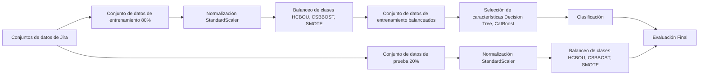

# JIRA Classification Pipeline

> 🎯 Pipeline de Machine Learning para Predicción de Defectos en Software usando Datasets JIRA

[](https://python.org)
[](https://jupyter.org)
[](https://scikit-learn.org)

## 📋 Descripción del Proyecto

Este repositorio implementa un pipeline completo de Machine Learning para la **predicción de defectos en software** utilizando datasets de proyectos reales extraídos de JIRA. El proyecto se enfoca en resolver problemas de **clasificación desbalanceada** mediante la implementación del método **HCBOU** (Hybrid Cluster-Based Oversampling and Undersampling) junto con técnicas como **CSBBOST** y **SMOTE**.

### 🎯 Objetivos Principales

- Predecir defectos de software usando métricas de código y proceso
- Manejar datasets desbalanceados mediante técnicas de balanceo híbridas
- Comparar diferentes algoritmos de clasificación (Random Forest, AdaBoost)
- Evaluar el rendimiento con múltiples métricas especializadas en datos desbalanceados

## 🏗️ Arquitectura del Pipeline



## 📁 Estructura del Repositorio

```
jira-classification-pipeline/
├── 📊 datasets/              # Datasets de proyectos de software
│   ├── activemq-5.0.0.csv
│   ├── groovy-1_6_BETA_1.csv
│   ├── hbase-0.94.0.csv
│   ├── derby-10.5.1.1.csv
│   └── ...
├── 🔧 preprocessing/         # Notebooks de preprocesamiento
│   ├── groovy-1_5_7.ipynb
│   ├── hbase-0.94.0.ipynb
│   └── ...
├── ⚖️ class-blance/         # Implementación de balanceo HCBOU
│   ├── activemq-5.0.0.ipynb
│   └── activemq-5.0.0-hcbou.ipynb
├── 🛠️ utils/                # Código de utilidades y análisis
│   └── HCBOU Code.ipynb
├── 📚 papers/               # Referencias académicas
│   ├── s41598-024-84786-2.pdf
│   └── yatish2019mining.pdf
└── 📖 docs/                 # Documentación del proyecto
    ├── README.md
    └── CLAUDE.md
```

## 🔧 Tecnologías y Dependencias

### Librerías Principales

```python
import pandas as pd                    # Manipulación de datos
import numpy as np                     # Operaciones numéricas
import scikit-learn                    # Machine Learning
import imblearn                        # Técnicas de balanceo
import matplotlib.pyplot as plt        # Visualización
import seaborn as sns                  # Visualización avanzada
```

### Algoritmos Implementados

- **🎯 Balanceo de Clases:**
  - HCBOU (Hybrid Cluster-Based Oversampling and Undersampling)
  - SMOTE (Synthetic Minority Oversampling Technique)
  - ClusterCentroids (Undersampling basado en clustering)

- **🧠 Clasificadores:**
  - Random Forest
  - AdaBoost
  - Gradient Boosting
  - OneVsRest / OneVsOne strategies

- **📏 Métricas de Evaluación:**
  - ROC-AUC Score
  - F1-Score
  - Geometric Mean
  - Cohen's Kappa
  - Precision/Recall

## 🚀 Configuración e Instalación

### 1. Clonar el Repositorio

```bash
git clone https://github.com/tu-usuario/jira-classification-pipeline.git
cd jira-classification-pipeline
```

### 2. Instalar Dependencias

```bash
# Instalar dependencias principales
pip install pandas numpy scikit-learn imbalanced-learn
pip install matplotlib seaborn jupyter
pip install openpyxl xlrd

# Para clustering avanzado
pip install scikit-fuzzy kneed
```

### 3. Ejecutar Jupyter Notebook

```bash
jupyter notebook
```

## 📊 Uso del Pipeline

### 1. Cargar y Preparar Datos

```python
import pandas as pd
from sklearn.model_selection import train_test_split
from sklearn.preprocessing import StandardScaler

# Cargar dataset
df = pd.read_csv('datasets/activemq-5.0.0.csv')

# Preparar características y target
X = df.drop(columns=['RealBug', 'HeuBug', 'HeuBugCount', 'RealBugCount'])
y = df['RealBug']

# División train/test
X_train, X_test, y_train, y_test = train_test_split(
    X, y, test_size=0.2, random_state=42
)
```

### 2. Aplicar Normalización

```python
# Normalizar características numéricas
scaler = StandardScaler()
X_train_numeric = X_train.select_dtypes(include=['float64', 'int64'])
X_train_scaled = scaler.fit_transform(X_train_numeric)
```

### 3. Balanceo de Clases con HCBOU

```python
# Configuración HCBOU
maxclusterMaj = 8      # Clusters para clase mayoritaria
maxclusterMin = 6      # Clusters para clase minoritaria
KSMOTE = 3            # Vecinos para SMOTE
MinClusterObs = 5     # Observaciones mínimas por cluster

# Aplicar HCBOU (ver utils/HCBOU Code.ipynb para implementación completa)
```

### 4. Entrenamiento y Evaluación

```python
from sklearn.ensemble import RandomForestClassifier
from sklearn.multiclass import OneVsRestClassifier
from sklearn.metrics import classification_report

# Entrenar modelo
clf = OneVsRestClassifier(RandomForestClassifier(random_state=42))
clf.fit(X_train_balanced, y_train_balanced)

# Evaluación
y_pred = clf.predict(X_test_scaled)
print(classification_report(y_test, y_pred))
```

## 📈 Datasets Disponibles

| Proyecto | Archivos | Defectos | Ratio | Descripción |
|----------|----------|----------|-------|-------------|
| ActiveMQ 5.0.0 | 1,884 | 293 | 15.5% | Message broker Java |
| Groovy 1.6 | 757 | 26 | 3.4% | Lenguaje dinámico JVM |
| HBase 0.94.0 | - | - | - | Base de datos NoSQL |
| Derby 10.5.1.1 | - | - | - | Base de datos Java |

### Métricas Incluidas

- **Métricas de Código:** LOC, Complejidad Ciclomática, Métodos, Clases
- **Métricas de Proceso:** Commits, Desarrolladores, Líneas añadidas/eliminadas
- **Target:** RealBug (boolean) - Indica si el archivo contiene defectos

## 🧪 Resultados y Evaluación

### Métricas de Evaluación Implementadas

```python
# Métricas para datos desbalanceados
- Geometric Mean Score
- ROC-AUC Multiclass
- Cohen's Kappa Score
- F1-Score Macro/Weighted
- Hamming Loss
```

### Estrategias de Validación

- **Train/Test Split:** 80/20
- **Cross-Validation:** K-Fold para validación robusta
- **Comparación de Métodos:** Original vs HCBOU vs SMOTE vs ClusterCentroids

## 📚 Referencias Académicas

Este proyecto se basa en investigación académica en predicción de defectos de software:

1. **HCBOU Method:** Hybrid Cluster-Based Oversampling and Undersampling
2. **Software Defect Prediction:** Machine Learning approaches
3. **Imbalanced Learning:** Techniques for skewed datasets

Ver carpeta `papers/` para referencias completas.

## 🤝 Contribuciones

Las contribuciones son bienvenidas. Para contribuir:

1. Fork el proyecto
2. Crea una rama para tu feature (`git checkout -b feature/AmazingFeature`)
3. Commit tus cambios (`git commit -m 'Add: Amazing Feature'`)
4. Push a la rama (`git push origin feature/AmazingFeature`)
5. Abre un Pull Request

## 📄 Licencia

Este proyecto está bajo la Licencia MIT. Ver `LICENSE` para más detalles.

## 📧 Contacto

- **Proyecto:** Predicción de errores en ISW
- **Universidad:** MIS UTM - 3er Semestre
- **Repositorio:** [GitHub](https://github.com/tu-usuario/jira-classification-pipeline)

---

⭐ Si este proyecto te resulta útil, ¡no olvides darle una estrella!